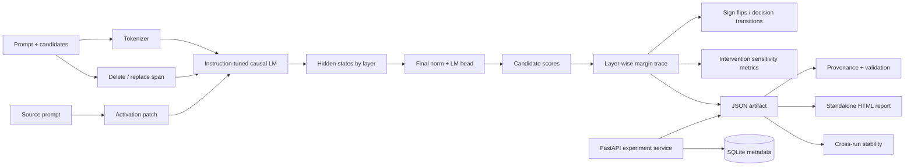

# Struct-XAI Platform

[](https://github.com/cagataykavas/struct-xai-platform/actions/workflows/ci.yml)

Struct-XAI is a compact, runnable interpretability platform for studying **how instruction-tuned causal language models form, revise, and transfer candidate decisions across layers**.

The project deliberately keeps the analysis surface small enough to audit. It exposes the exact scoring assumptions, interventions, activation hooks, experiment metadata, quantitative comparison metrics, and reproducibility checks instead of hiding them behind a generic “XAI” wrapper.

> Public research/demo implementation only. No employer prompts, model artifacts, confidential datasets, or proprietary evaluation material are included.

## Why this project exists

Interpretability experiments are easy to turn into attractive plots and hard to turn into reproducible evidence. Struct-XAI treats an explanation as an **experiment artifact** with three separate questions:

1. **What did the model prefer at each layer?**
2. **Did a controlled intervention causally change the measured decision trace?**
3. **Can another run reproduce the same trace, and can we prove which configuration produced it?**

That separation is reflected directly in the codebase.

## Implemented capabilities

| Area | Implemented |
| --- | --- |
| Layer-wise analysis | final-position hidden-state projection, candidate-aware scores, winner/runner-up trace |
| Decision dynamics | signed candidate margins, sign-flip detection, peak effect layer |
| Prompt interventions | reproducible literal deletion and replacement |
| Causal intervention | single-layer final-position activation patching with forward hooks |
| Quantitative evaluation | mean/max margin shift, final winner change, sign-flip count, intervention sensitivity |
| Repeatability | cross-run Pearson correlation, sign agreement, absolute margin drift, final-winner agreement |
| Provenance | experiment fingerprint, prompt/candidate SHA-256, model, metric, device/dtype, runtime versions, source revision |
| Artifact validation | prompt/model/fingerprint checks and base-vs-variant layer alignment |
| Outputs | JSON experiment artifacts and standalone HTML reports |
| Interfaces | installable CLI and FastAPI experiment service |
| Persistence | SQLite experiment metadata for the local reference service |
| Engineering | CPU-only CI, deterministic unit tests, Docker image |

## Architecture



## Install

```bash
python -m venv .venv
source .venv/bin/activate  # Windows: .venv\Scripts\activate
pip install -e '.[dev]'
```

The default runnable examples use `Qwen/Qwen2.5-0.5B-Instruct`. The current Hugging Face adapter supports decoder models exposing a conventional final normalization layer and LM head.

## 1. Run a layer-wise candidate experiment

```bash
struct-xai compare \
  --name turkey-capital \
  --prompt 'Question: What is the capital of Turkey? Answer:' \
  --candidates ' Ankara' ' Istanbul' \
  --delete 'Turkey'
```

This writes both machine-readable and reviewable outputs:

```text
artifacts/turkey-capital.json
artifacts/turkey-capital.html
```

A replacement intervention is equally explicit:

```bash
struct-xai compare \
  --name country-replacement \
  --prompt 'Question: What is the capital of Turkey? Answer:' \
  --candidates ' Ankara' ' Athens' \
  --replace 'Turkey' \
  --with 'Greece'
```

## 2. Understand the layer metric

At each layer, the final-token hidden state is projected through the model's final normalization layer and language-model head. Candidate labels are tokenized and the **first token of each candidate** is scored.

For candidates A and B:

```text
margin(layer) = logit(first_token(A)) - logit(first_token(B))
```

The metric is intentionally named `first_token_candidate_logit_margin`. It is useful for tracing candidate preference formation, but **it is not represented as a full sequence probability or a complete attribution method for multi-token answers**.

A sign flip is recorded when this signed margin changes direction between layers. That provides a compact view of where the internal candidate preference changes rather than looking only at the final output.

## 3. Quantify intervention effects

Every experiment artifact contains quantitative intervention evaluation in addition to trajectories.

For every candidate pair, Struct-XAI reports:

- baseline initial/final and mean absolute margin;
- final margin change after intervention;
- mean and maximum absolute margin shift across layers;
- the layer with the largest intervention effect;
- whether the final pairwise winner changed;
- sign-flip count under the intervention.

Offline validation and metric recomputation require no model download:

```bash
struct-xai evaluate artifacts/turkey-capital.json --fail-invalid
```

The command checks the artifact's experiment identity and structural consistency before reporting the stored decision evidence.

## 4. Measure cross-run explanation stability

Two runs of the same experiment can be compared directly:

```bash
struct-xai stability \
  artifacts/run-a.json \
  artifacts/run-b.json \
  --output artifacts/stability.json
```

For every candidate pair the stability report includes:

```text
Pearson correlation of layer-wise margins
mean / maximum absolute margin difference
layer-wise sign agreement rate
final margin difference
final pairwise winner agreement
```

These metrics quantify **repeatability of the measured decision trace**. A high correlation is not claimed to prove causal faithfulness; faithfulness and repeatability are kept as separate concepts.

## 5. Activation patching

```bash
struct-xai patch \
  --source-prompt 'Question: What is the capital of Turkey? Answer:' \
  --target-prompt 'Question: What is the capital of Greece? Answer:' \
  --layer 8 \
  --candidates ' Ankara' ' Athens'
```

The public patching experiment is intentionally narrow and inspectable. It captures the **final-position residual state** from a source run at one transformer layer, injects it into the target run at the same layer, and measures final candidate-logit changes.

This is implemented with real forward hooks; it is not a static diagram standing in for activation patching.

## Experiment artifact and provenance

A JSON artifact contains:

```text
experiment
├── name / prompt / candidates / model
base
├── layer-wise candidate decisions
└── sign flips
variants
├── intervention metadata
├── changed prompt
└── layer-wise analysis
intervention_evaluation
provenance
├── experiment fingerprint
├── prompt SHA-256
├── candidate SHA-256
├── model + metric
├── requested/resolved device + dtype
├── Python / Torch / Transformers versions
└── source revision when available
```

The provenance validator detects configuration drift, prompt/model mismatch, fingerprint mismatch, and base/variant layer misalignment. This is meant to make a report traceable to the experiment that generated it rather than treating an HTML plot as sufficient evidence by itself.

## HTML reports

`struct-xai report` renders an existing artifact without rerunning the model:

```bash
struct-xai report artifacts/turkey-capital.json
```

The standalone report surfaces:

- model and explicit analysis metric;
- prompt and candidate set;
- layer-wise margin trace;
- decision sign flips;
- intervention summaries;
- quantitative intervention sensitivity;
- experiment fingerprint and runtime provenance.

## Experiment service

Run the reference API:

```bash
uvicorn cloud_service.api:app --reload
```

Endpoints:

- `GET /health`
- `POST /experiments`
- `GET /experiments`
- `GET /experiments/{id}`

Submitted experiments move through queued → running → completed/failed states. Metadata is persisted in SQLite while JSON and HTML artifacts are written under `artifacts/runs/<experiment-id>/`.

The service intentionally keeps orchestration separate from model internals. For a multi-worker deployment, the background-task boundary can be replaced by a durable queue and the metadata adapter by PostgreSQL without rewriting the interpretability core.

## Repository structure

```text
structxai/
  core.py            candidate scoring and layer decisions
  hf_runner.py       Hugging Face model adapter
  interventions.py   controlled prompt mutations
  patching.py        activation patching
  evaluation.py      intervention-effect metrics
  stability.py       cross-run repeatability metrics
  provenance.py      fingerprints and artifact validation
  experiment.py      experiment orchestration
  report.py          standalone HTML reporting
  cli.py             command-line interface

cloud_service/       API and metadata persistence
research/            compact public research examples
tests/               deterministic model-free tests
```

## CI philosophy

The default CI path intentionally does **not** download a language-model checkpoint. It validates the deterministic engineering surface using CPU-only PyTorch:

- candidate scoring and margins;
- sign-flip detection;
- deletion/replacement interventions;
- quantitative intervention evaluation;
- provenance validation;
- cross-run stability metrics;
- HTML report generation;
- experiment metadata lifecycle;
- CLI/package imports;
- Docker build.

Heavy GPU/model integration belongs in a separate explicit experiment run rather than burning multi-gigabyte CUDA downloads on every documentation commit.

## Methodological boundaries

The repository tries to make its limitations visible:

- first-token candidate margins are not full candidate sequence likelihoods;
- logit-lens projections are diagnostic views, not automatically causal explanations;
- deletion/replacement effects can be confounded by distribution shift;
- activation patching is currently limited to one layer and the final sequence position;
- cross-run stability measures repeatability, not truth;
- a visually clean heatmap is not treated as evidence without an explicit metric and experiment identity.

## Research directions

Next research-oriented extensions include:

- full candidate sequence log-probability scoring;
- candidate-aware gradient/span attribution;
- token × layer heatmaps;
- activation-patching sweeps over layer × token position;
- clean/corrupted causal tracing;
- multi-model comparison matrices;
- compact Turkish instruction-model benchmark suites;
- queue-backed distributed experiment workers.

## Interview topics

**logit lens · hidden states · candidate margins · sign flips · controlled interventions · activation patching · causal vs correlational explanation · explanation faithfulness · repeatability · experiment provenance · artifact validation · model hooks · reproducible research systems · FastAPI · Docker · CI.**
