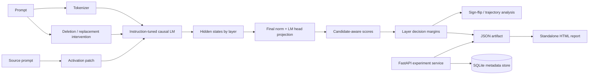

# Struct-XAI Platform

Struct-XAI is a runnable interpretability toolkit and experiment service for studying **how instruction-tuned causal language models form, revise and transfer decisions across layers**.

The public implementation is intentionally small enough to audit. It does not hide interpretability calculations behind a generic “XAI” wrapper.

> Public research/demo code only. No employer prompts, model artifacts, confidential datasets or proprietary evaluation material are included.

## What is implemented

- candidate-aware layer-wise logit projection;
- explicit **first-token candidate margin** instead of mislabeling it as full multi-token probability;
- winner/runner-up decision traces across every hidden layer;
- layer-wise signed decision gaps and sign-flip detection;
- reproducible literal-span **deletion and replacement interventions**;
- base-vs-intervention trajectory comparison;
- single-layer **activation patching** of the final sequence position;
- Qwen/GPT-style Hugging Face decoder adapters;
- JSON experiment artifacts;
- standalone dark HTML reports with layer-margin visualizations;
- installable `struct-xai` CLI;
- FastAPI experiment queue/service;
- persistent SQLite experiment metadata for the local runnable baseline;
- Docker image and CI tests that do not need to download a model.

## Architecture



## Install

```bash
python -m venv .venv
source .venv/bin/activate  # Windows: .venv\Scripts\activate
pip install -e '.[dev]'
```

The default examples use `Qwen/Qwen2.5-0.5B-Instruct`, but the core supports decoder models exposing a standard final normalization layer and language-model head.

## Layer-wise candidate experiment

```bash
struct-xai compare \
  --name turkey-capital \
  --prompt 'Question: What is the capital of Turkey? Answer:' \
  --candidates ' Ankara' ' Istanbul' \
  --delete 'Turkey'
```

The command writes:

```text
artifacts/turkey-capital.json
artifacts/turkey-capital.html
```

A replacement intervention is equally explicit:

```bash
struct-xai compare \
  --name country-replacement \
  --prompt 'Question: What is the capital of Turkey? Answer:' \
  --candidates ' Ankara' ' Athens' \
  --replace 'Turkey' \
  --with 'Greece'
```

## What the layer metric means

At each hidden layer, the final-token hidden state is projected through the model's final normalization layer and LM head. Candidate labels are tokenized and the **first token of each candidate** is scored.

For two candidates A and B:

```text
margin(layer) = logit(first_token(A)) - logit(first_token(B))
```

This is useful for tracing when a model begins favoring one candidate over another. It is **not** presented as a full sequence log-probability for multi-token answers. That distinction is deliberate.

## Sign flips

A sign flip occurs when the signed A-vs-B candidate margin changes sign between layers. The toolkit records the previous/current margin and layer where the preference changed. This gives a compact way to locate internal decision transitions rather than only inspecting the final answer.

## Structured interventions

`structxai/interventions.py` creates reproducible character-span interventions:

- delete a literal span;
- replace a literal span with a controlled alternative.

The experiment runner executes the base prompt and each variant, then stores layer-wise trajectories in one artifact for comparison.

## Activation patching

```bash
struct-xai patch \
  --source-prompt 'Question: What is the capital of Turkey? Answer:' \
  --target-prompt 'Question: What is the capital of Greece? Answer:' \
  --layer 8 \
  --candidates ' Ankara' ' Athens'
```

The current public patching experiment is intentionally narrow and interpretable: it captures the **final-position residual state** from the source run at one transformer layer, injects it into the target run at the same layer, then reports candidate-logit deltas at the final output.

It is a real forward-hook intervention, not a diagram pretending to be activation patching.

## Experiment service

Run the API:

```bash
uvicorn cloud_service.api:app --reload
```

Endpoints:

- `GET /health`
- `POST /experiments`
- `GET /experiments`
- `GET /experiments/{id}`

Submitted jobs are persisted as queued/running/completed/failed records. Heavy model work executes as a background task in the local reference service and writes JSON + HTML artifacts under `artifacts/runs/<experiment-id>/`.

For a multi-worker production deployment, the background-task boundary is the obvious place to replace in-process execution with a real queue such as Celery/RQ/SQS/Kafka and the SQLite metadata adapter with PostgreSQL.

## Research-to-platform boundary

The repository separates three concerns:

```text
structxai/          reusable analysis and intervention code
cloud_service/      orchestration + experiment metadata API
research/           compact historical/research examples
```

That makes the project useful both as an interpretability research codebase and as an example of operationalizing experiments without mixing model internals into HTTP/database logic.

## CI philosophy

CI tests the deterministic pieces without downloading a language model:

- candidate scoring/margins;
- sign-flip detection;
- interventions;
- HTML report generation;
- experiment metadata lifecycle;
- package/CLI imports;
- Docker build.

GPU/model integration tests can be run separately because forcing a 0.5B+ checkpoint download on every documentation commit would be wasteful.

## Research directions

The current public platform is ready to extend with:

- full candidate sequence log-probability scoring;
- span/token attribution and candidate-aware gradients;
- token × layer heatmaps;
- patch sweeps across every layer and token position;
- clean/corrupted prompt causal tracing;
- batched multi-model comparisons;
- compact Turkish instruction-model evaluation suites;
- queue-backed distributed experiment workers.

## Interview topics

**logit lens · hidden states · candidate margins · intervention design · activation patching · causal vs correlational explanations · sign flips · model hooks · experiment reproducibility · background jobs · artifact persistence · small-model evaluation.**
